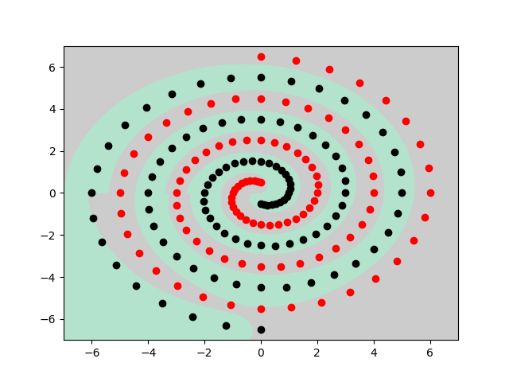
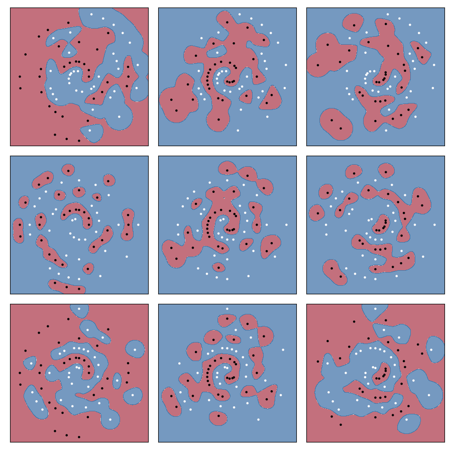
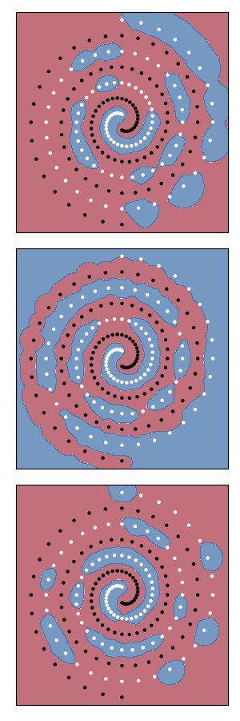
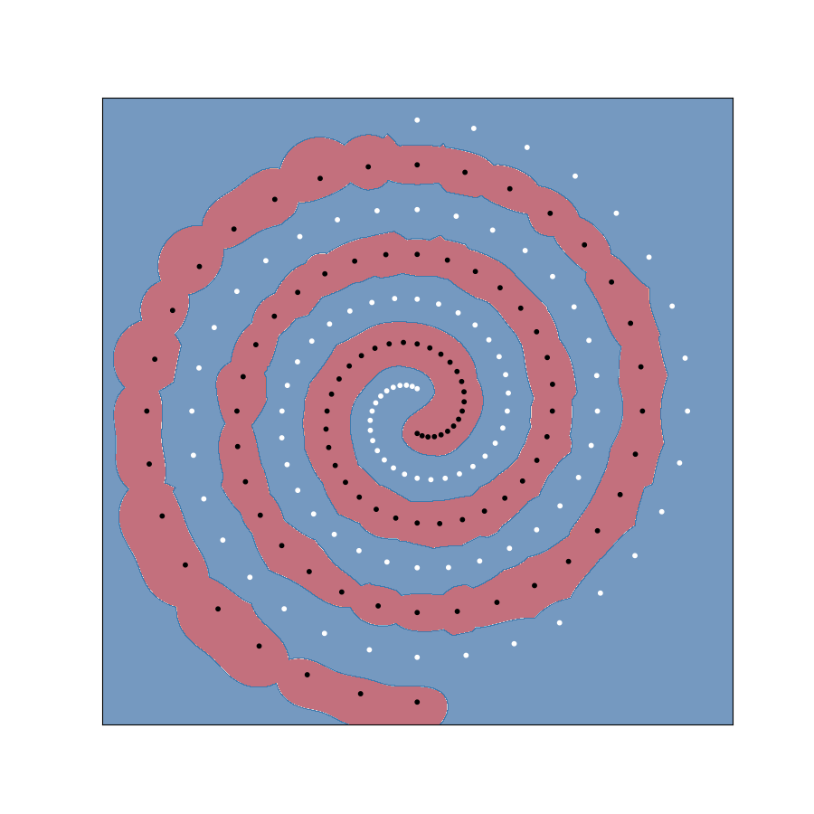

# The Two Spirals Problem
I trained 2 network to solve this problem, one is the simple multi-layer perceptron which takes polar coordinates as input, only 1 hidden layer with 16 neurons is needed, the network converged within 3000 epochs and the prediction accuracy reaches 100%. The other is the Min-Max Modular Network, which may be a little bit complicated.

Package needed,
- torch
- sklearn
- matplotlib

To plot the problem, run this script,
```
python3 plotSpirals.py
```
## Perceptron
Run this script,
```
python3 multilayerPerceptron.py
```
The prediction result is saved as ```prediction_graph.png```,



## Min-Max Modular Network
This is an implementation of the Min-Max Modular Network proposed by Prof. Baoliang Lu.

I used SVM as submodule to tackle the decomposed problem.

Run this script,
```
python3 m3net.py
```

The prediction result for each decomposed problem,



The min-gate,



And the final result, max-gate,



Prediction accuracy is 100%.